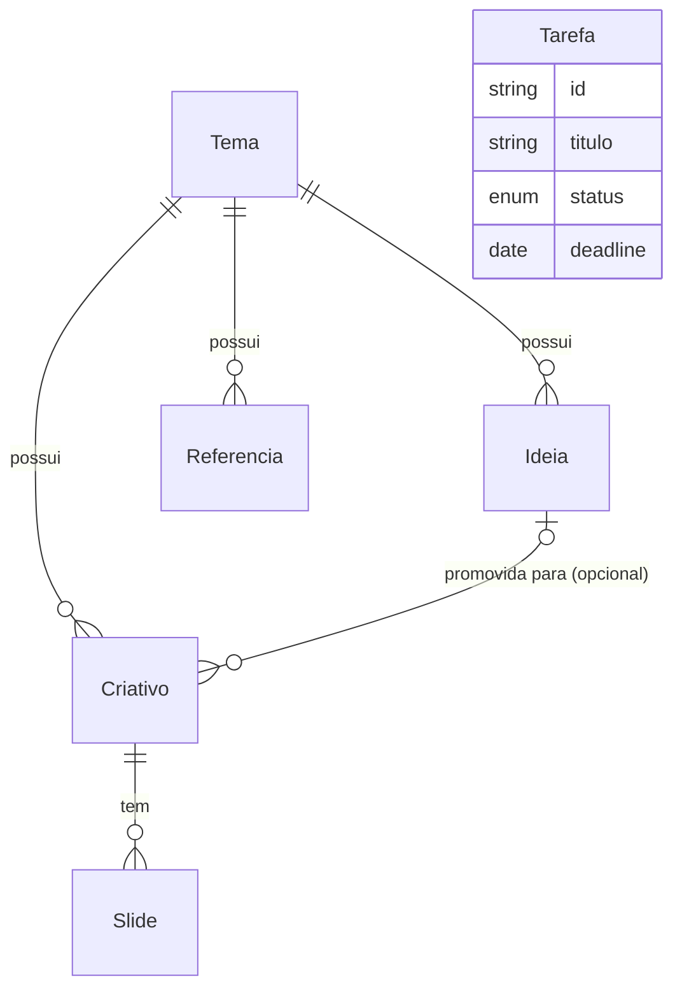

# Esquema Prisma · Social Creative

> **Status: implementado de verdade.** O schema abaixo já está aplicado no
> projeto Supabase real (`stdahweyubzishcufial`), como SQL declarativo em
> `supabase/schemas/*.sql` (não como Prisma/`prisma migrate` — este
> documento nasceu com sintaxe Prisma como especificação, mas a
> implementação seguiu as convenções do `.claude/agents/db-architect.md`:
> tabelas/colunas em `snake_case`, RLS permissiva em modo aberto sem login,
> `save_criativo(jsonb, jsonb)` como RPC transacional para Criativo+Slides).
> O frontend já fala com esse banco via `@supabase/supabase-js`
> (`src/lib/supabase/client.ts` + `src/lib/repository/supabaseRepository.ts`
> + `src/features/criativos/criativosRepository.ts`); `src/lib/seed/` e
> `localStorageRepository.ts` foram removidos. Tipos gerados em
> `src/types/supabase.ts`. Este documento continua sendo a referência de
> *o quê* persistir — a regra permanente abaixo agora vale para
> `supabase/schemas/*.sql`, não mais para um `prisma/schema.prisma` futuro.

Este documento é a fonte de verdade do modelo de dados do projeto. Ele espelha 1:1 os tipos TypeScript que hoje vivem em `src/types/*.ts`.

**Regra permanente:** sempre que uma funcionalidade nova precisar guardar dado (campo novo, entidade nova, relação nova), atualize **este arquivo E `supabase/schemas/*.sql`** no mesmo PR/sessão que implementa a funcionalidade — os dois documentos (conceitual aqui, SQL real lá) têm que ficar sincronizados com o banco de verdade.

## Convenções adotadas

- **Banco:** PostgreSQL, hospedado no Supabase (projeto `stdahweyubzishcufial`).
- **IDs:** `uuid default gen_random_uuid()` no banco; o frontend continua gerando `crypto.randomUUID()` no cliente antes de chamar `create()` (repositório não depende do default do banco, mas ele existe como defesa).
- **Nomes de tabela/coluna:** **snake_case, plural** no banco real (`temas`, `tema_id`, `data_publicacao`...) — isso diverge do que este documento dizia originalmente ("camelCase sem tradução"), porque a implementação seguiu a convenção obrigatória do `.claude/agents/db-architect.md` em vez desta. A tradução camelCase (frontend) ⇄ snake_case (banco) é feita em `src/lib/repository/caseMap.ts`, então nenhuma tela ou store precisou mudar.
- **Timestamps:** toda tabela tem `created_at timestamptz default now()` e `updated_at timestamptz`, este último mantido por um trigger compartilhado (`set_updated_at()`, ver `supabase/schemas/00_common.sql`) — não confiar que a aplicação manda esse campo certo, o banco garante sozinho.
- **Datas "sem hora"** (`data_publicacao` do Criativo, `deadline` da Tarefa): coluna `date` no Postgres. `supabase-js`/PostgREST devolve e aceita isso como string `YYYY-MM-DD` puro — igual ao tipo TS (`dataPublicacao?: string`) — **sem** a conversão Prisma `Date`↔string que este documento mencionava antes; essa preocupação era específica do Prisma Client e não se aplica à implementação real.
- **Enums:** `criativo_formato` guarda os literais `'4:5'`/`'1:1'` como rótulo de enum Postgres diretamente (qualquer string entre aspas é um rótulo válido em SQL — não precisou do truque `@map` do Prisma).
- **Sem autenticação/multi-tenant ainda.** Decisão confirmada com o usuário: RLS ativa em todas as 6 tabelas, policies permissivas (`using (true)`/`with check (true)`) separadas por operação, sem coluna `user_id`/`workspace_id`. Ver pendência no final deste arquivo para quando isso mudar.
- **Sem soft delete.** Exclusão é hard delete (`on delete cascade` nas relações filhas) — testado via Playwright: excluir um Tema derruba Ideias/Referências/Criativos/Slides dependentes numa cascata só.

## Diagrama de relações



`Tarefa` fica isolada de propósito (checklist independente, sem FK para nenhuma outra entidade — ver PRD seção 6.7).

## Schema completo (`prisma/schema.prisma`)

```prisma
generator client {
  provider = "prisma-client-js"
}

datasource db {
  provider = "postgresql"
  url      = env("DATABASE_URL")
}

// ---------- Enums ----------

enum ReferenciaTipo {
  link
  site
  anotacao
}

enum CriativoStatus {
  rascunho
  pronto
  agendado
  publicado
}

enum CriativoFormato {
  quatro_cinco @map("4:5")
  um_um        @map("1:1")
}

enum SlideStatus {
  vazio
  gerando
  gerado
  editado
  erro
}

enum TarefaStatus {
  pendente
  em_andamento
  concluida
}

// ---------- Models ----------

/// Container temático que organiza Ideias, Referências e Criativos.
/// Ver src/types/tema.ts
model Tema {
  id        String   @id @default(uuid())
  nome      String
  cor       String
  icone     String
  descricao String   @default("")
  createdAt DateTime @default(now())
  updatedAt DateTime @updatedAt

  ideias      Ideia[]
  referencias Referencia[]
  criativos   Criativo[]
}

/// Ideia de conteúdo, gerada por IA ou anotada manualmente.
/// Ver src/types/ideia.ts e src/features/ideias/useIdeiasStore.ts
model Ideia {
  id        String   @id @default(uuid())
  temaId    String
  titulo    String
  resumo    String   @default("")
  promovida Boolean  @default(false)
  createdAt DateTime @default(now())
  updatedAt DateTime @updatedAt

  tema      Tema       @relation(fields: [temaId], references: [id], onDelete: Cascade)
  criativos Criativo[]

  @@index([temaId])
}

/// Link colado (com extração de conteúdo), site recorrente cadastrado, ou anotação livre.
/// Ver src/types/referencia.ts
model Referencia {
  id        String         @id @default(uuid())
  temaId    String
  tipo      ReferenciaTipo
  titulo    String
  url       String?
  conteudo  String         @default("")
  createdAt DateTime       @default(now())
  updatedAt DateTime       @updatedAt

  tema Tema @relation(fields: [temaId], references: [id], onDelete: Cascade)

  @@index([temaId])
}

/// Carrossel: unidade de criação e gestão de conteúdo, com IA (texto/imagem)
/// prevista para a Fase 10. Ver src/types/criativo.ts
model Criativo {
  id             String          @id @default(uuid())
  temaId         String
  ideiaId        String?
  titulo         String
  status         CriativoStatus  @default(rascunho)
  formato        CriativoFormato
  /// Data de publicação planejada, definida na Agenda (Fase 8). Sem hora.
  dataPublicacao DateTime?       @db.Date
  createdAt      DateTime        @default(now())
  updatedAt      DateTime        @updatedAt

  tema   Tema    @relation(fields: [temaId], references: [id], onDelete: Cascade)
  ideia  Ideia?  @relation(fields: [ideiaId], references: [id], onDelete: SetNull)
  slides Slide[]

  @@index([temaId])
  @@index([ideiaId])
  @@index([status])
}

/// Um slide dentro do carrossel de um Criativo. Ordem definida por `ordem`
/// (0-based), não pela ordem de criação. Ver src/types/criativo.ts#Slide
model Slide {
  id           String      @id @default(uuid())
  criativoId   String
  ordem        Int
  texto        String      @default("")
  imagemUrl    String?
  /// Prompt de texto usado na geração (histórico), guardado mesmo que o
  /// usuário edite o texto depois.
  promptTexto  String?
  /// Prompt de imagem usado na geração (histórico).
  promptImagem String?
  status       SlideStatus @default(vazio)
  createdAt    DateTime    @default(now())
  updatedAt    DateTime    @updatedAt

  criativo Criativo @relation(fields: [criativoId], references: [id], onDelete: Cascade)

  @@unique([criativoId, ordem])
}

/// Checklist independente do fluxo de conteúdo. Sem FK pra nenhuma outra
/// entidade, de propósito (PRD seção 6.7). Ver src/types/tarefa.ts
model Tarefa {
  id        String       @id @default(uuid())
  titulo    String
  status    TarefaStatus @default(pendente)
  /// Prazo opcional. Sem hora.
  deadline  DateTime?    @db.Date
  createdAt DateTime     @default(now())
  updatedAt DateTime     @updatedAt

  @@index([status])
  @@index([deadline])
}
```

## Mapeamento model → tipo TS → observações

| Model Prisma | Tipo TS (`src/types/`) | Observações |
|---|---|---|
| `Tema` | `Tema` (`tema.ts`) | 1:1 direto. `icone` é o emoji (Fase de revisão pós-Fase-9). |
| `Ideia` | `Ideia` (`ideia.ts`) | 1:1 direto. |
| `Referencia` | `Referencia` (`referencia.ts`) | 1:1 direto. `url` é opcional (anotação livre não tem). |
| `Criativo` | `Criativo` (`criativo.ts`) | `slides` deixa de ser array embutido e vira relação 1:N com `Slide`. `dataPublicacao` é `string` (YYYY-MM-DD) no TS e `DateTime @db.Date` no Prisma — precisa de conversão na camada de repositório real. |
| `Slide` | `Slide` (`criativo.ts`) | Hoje é sub-objeto dentro de `Criativo.slides[]` no localStorage; no Postgres vira tabela própria com FK `criativoId` e `@@unique([criativoId, ordem])` pra garantir uma posição por slide. |
| `Tarefa` | `Tarefa` (`tarefa.ts`) | 1:1 direto. `deadline` mesma observação de `dataPublicacao`. |

## Como isso se conecta com o código hoje

O projeto foi construído em cima do padrão `Repository<T>` (`src/lib/repository/types.ts`):

```ts
interface Repository<T extends { id: string }> {
  list(): Promise<T[]>
  get(id: string): Promise<T | undefined>
  create(item: T): Promise<T>
  update(id: string, patch: Partial<T>): Promise<T>
  remove(id: string): Promise<void>
}
```

Implementado hoje contra o Supabase real:

- `src/lib/supabase/client.ts` — cliente único (`VITE_SUPABASE_URL`/`VITE_SUPABASE_ANON_KEY`, em `.env.local`, nunca commitado).
- `src/lib/repository/caseMap.ts` — tradução camelCase (frontend) ⇄ snake_case (banco), incluindo a regra de converter `undefined` explícito em `null` real (crítico para `Criativo.dataPublicacao`/`Tarefa.deadline` ao limpar o campo).
- `src/lib/repository/supabaseRepository.ts` — fábrica genérica (`createSupabaseRepository<T>(table)`), usada por `temasRepository`, `ideiasRepository`, `referenciasRepository`, `tarefasRepository`.
- `src/features/criativos/criativosRepository.ts` — repositório sob medida (não genérico): busca `criativos` com `select('*, slides(*)')` e monta de volta o shape `Criativo.slides: Slide[]`; `create`/`update` chamam a RPC `save_criativo` (upsert transacional de Criativo + todos os Slides de uma vez, espelhando o padrão "objeto inteiro" que `useCriativosStore.ts` já usava).
- **Nenhuma store, página ou componente mudou** — só a fábrica de cada `xRepository.ts` trocou de implementação, exatamente como o padrão foi desenhado desde a Fase 0.

## Dados de exemplo (seed)

`src/lib/seed/` foi removido junto com a chamada em `src/main.tsx` — o app não seeda mais dados falsos, fala direto com o Supabase real (hoje vazio, populado pelo uso normal).

## Pendências / decisões que ainda não foram tomadas

Não implementar nada abaixo sem confirmação explícita — são decisões do produto, não técnicas:

- **Autenticação / multi-tenant:** se o sistema ganhar login (PRD seção 10, ponto em aberto), todo model acima precisa de uma FK de dono (`userId` ou `workspaceId`) + um model `Usuario`/`Workspace`. Isso muda índices e políticas de acesso (RLS no Supabase, por exemplo).
- **Busca por domínio (Fase 12):** se a busca dentro de sites cadastrados em `Referencia` vingar, provavelmente precisa de um model novo pra guardar resultados de busca/crawler — ainda não modelado aqui.
- **IA real (Fase 10):** nenhum campo novo é necessário no schema só por causa da integração real com Claude/Gemini — `Slide.promptTexto`/`promptImagem` já guardam o que for necessário pro histórico. As chaves de API (`ANTHROPIC_API_KEY`, `GEMINI_API_KEY`) NUNCA entram neste schema — elas vivem em variável de ambiente do backend, nunca em tabela.
