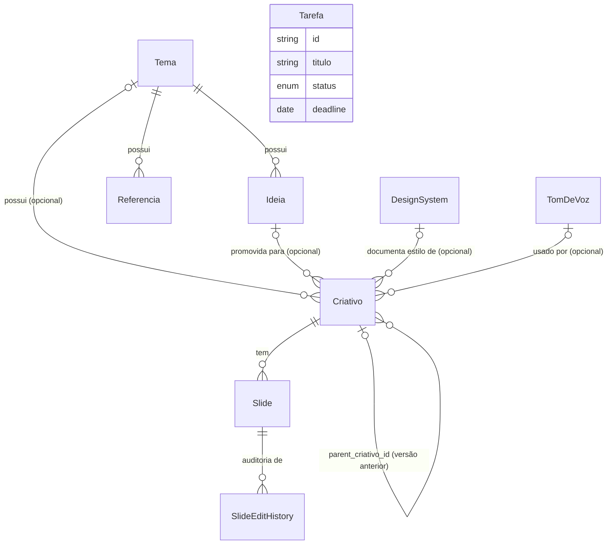

# Esquema Prisma · Social Creative

> **Status: implementado de verdade.** O schema abaixo já está aplicado no
> projeto Supabase real (`stdahweyubzishcufial`), como SQL declarativo em
> `supabase/schemas/*.sql` (não como Prisma/`prisma migrate` — este
> documento nasceu com sintaxe Prisma como especificação, mas a
> implementação seguiu as convenções do `.claude/agents/db-architect.md`:
> tabelas/colunas em `snake_case`, RLS permissiva em modo aberto sem login,
> `save_criativo(jsonb, jsonb)` como RPC transacional para Criativo+Slides).
> O frontend já fala com esse banco via `@supabase/supabase-js`
> (`src/lib/supabase/client.ts` + `src/lib/repository/supabaseRepository.ts`
> + `src/features/criativos/criativosRepository.ts`); `src/lib/seed/` e
> `localStorageRepository.ts` foram removidos. Tipos gerados em
> `src/types/supabase.ts`. Este documento continua sendo a referência de
> *o quê* persistir — a regra permanente abaixo agora vale para
> `supabase/schemas/*.sql`, não mais para um `prisma/schema.prisma` futuro.
>
> `design_systems`, `tons_de_voz`, `slide_edit_history` e as colunas novas
> de `criativos`/`slides` (arquitetura de nodes) foram aplicadas no banco
> real via `supabase/migrations/20260722215753_nodes.sql` (mesmo conteúdo de
> `supabase/schemas/07_nodes.sql`) e validadas via REST — não só a Fase 0-9,
> a arquitetura de nodes também já está "implementada de verdade".

Este documento é a fonte de verdade do modelo de dados do projeto. Ele espelha 1:1 os tipos TypeScript que hoje vivem em `src/types/*.ts`.

**Regra permanente:** sempre que uma funcionalidade nova precisar guardar dado (campo novo, entidade nova, relação nova), atualize **este arquivo E `supabase/schemas/*.sql`** no mesmo PR/sessão que implementa a funcionalidade — os dois documentos (conceitual aqui, SQL real lá) têm que ficar sincronizados com o banco de verdade.

## Convenções adotadas

- **Banco:** PostgreSQL, hospedado no Supabase (projeto `stdahweyubzishcufial`).
- **IDs:** `uuid default gen_random_uuid()` no banco; o frontend continua gerando `crypto.randomUUID()` no cliente antes de chamar `create()` (repositório não depende do default do banco, mas ele existe como defesa).
- **Nomes de tabela/coluna:** **snake_case, plural** no banco real (`temas`, `tema_id`, `data_publicacao`...) — isso diverge do que este documento dizia originalmente ("camelCase sem tradução"), porque a implementação seguiu a convenção obrigatória do `.claude/agents/db-architect.md` em vez desta. A tradução camelCase (frontend) ⇄ snake_case (banco) é feita em `src/lib/repository/caseMap.ts`, então nenhuma tela ou store precisou mudar.
- **Timestamps:** toda tabela tem `created_at timestamptz default now()` e `updated_at timestamptz`, este último mantido por um trigger compartilhado (`set_updated_at()`, ver `supabase/schemas/00_common.sql`) — não confiar que a aplicação manda esse campo certo, o banco garante sozinho.
- **Datas "sem hora"** (`data_publicacao` do Criativo, `deadline` da Tarefa): coluna `date` no Postgres. `supabase-js`/PostgREST devolve e aceita isso como string `YYYY-MM-DD` puro — igual ao tipo TS (`dataPublicacao?: string`) — **sem** a conversão Prisma `Date`↔string que este documento mencionava antes; essa preocupação era específica do Prisma Client e não se aplica à implementação real.
- **Enums:** `criativo_formato` guarda os literais `'4:5'`/`'1:1'` como rótulo de enum Postgres diretamente (qualquer string entre aspas é um rótulo válido em SQL — não precisou do truque `@map` do Prisma).
- **Sem autenticação/multi-tenant ainda.** Decisão confirmada com o usuário: RLS ativa em todas as 6 tabelas, policies permissivas (`using (true)`/`with check (true)`) separadas por operação, sem coluna `user_id`/`workspace_id`. Ver pendência no final deste arquivo para quando isso mudar.
- **Sem soft delete.** Exclusão é hard delete (`on delete cascade` nas relações filhas) — testado via Playwright: excluir um Tema derruba Ideias/Referências/Criativos/Slides dependentes numa cascata só.

## Diagrama de relações



`Tarefa` fica isolada de propósito (checklist independente, sem FK para nenhuma outra entidade — ver PRD seção 6.7).

**Arquitetura de nodes (pivô pós-Fase-10):** Criativo passou a ser criado por um canvas de nodes em vez de formulário linear — um Node Principal (que já é o próprio `Criativo`, com os campos novos abaixo) gera Sub-Nodes por slide (já é o próprio `Slide`, também com campos novos). Nenhuma tabela paralela `carousels`/`carousel_slides` foi criada — decisão deliberada de reaproveitar `criativos`/`slides` em vez de duplicar (ver `CLAUDE.md`, regra de componentização/reuso, aplicada aqui ao modelo de dados). Ver `supabase/schemas/07_nodes.sql`.

## Schema completo (`prisma/schema.prisma`)

```prisma
generator client {
  provider = "prisma-client-js"
}

datasource db {
  provider = "postgresql"
  url      = env("DATABASE_URL")
}

// ---------- Enums ----------

enum ReferenciaTipo {
  link
  site
  anotacao
}

enum CriativoStatus {
  rascunho
  pronto
  agendado
  publicado
}

enum CriativoFormato {
  quatro_cinco @map("4:5")
  um_um        @map("1:1")
}

enum SlideStatus {
  vazio
  gerando
  gerado
  editado
  erro
}

/// Tipo do Sub-Node: define quais campos de texto o slide usa.
enum SlideTipo {
  cover
  body
  cta
}

enum SlideImageSource {
  none
  uploaded
  generated
}

enum TarefaStatus {
  pendente
  em_andamento
  concluida
}

// ---------- Models ----------

/// Container temático que organiza Ideias, Referências e Criativos.
/// Ver src/types/tema.ts
model Tema {
  id        String   @id @default(uuid())
  nome      String
  cor       String
  icone     String
  descricao String   @default("")
  createdAt DateTime @default(now())
  updatedAt DateTime @updatedAt

  ideias      Ideia[]
  referencias Referencia[]
  criativos   Criativo[]
}

/// Ideia de conteúdo, gerada por IA ou anotada manualmente.
/// Ver src/types/ideia.ts e src/features/ideias/useIdeiasStore.ts
model Ideia {
  id        String   @id @default(uuid())
  temaId    String
  titulo    String
  resumo    String   @default("")
  promovida Boolean  @default(false)
  createdAt DateTime @default(now())
  updatedAt DateTime @updatedAt

  tema      Tema       @relation(fields: [temaId], references: [id], onDelete: Cascade)
  criativos Criativo[]

  @@index([temaId])
}

/// Link colado (com extração de conteúdo), site recorrente cadastrado, ou anotação livre.
/// Ver src/types/referencia.ts
model Referencia {
  id        String         @id @default(uuid())
  temaId    String
  tipo      ReferenciaTipo
  titulo    String
  url       String?
  conteudo  String         @default("")
  createdAt DateTime       @default(now())
  updatedAt DateTime       @updatedAt

  tema Tema @relation(fields: [temaId], references: [id], onDelete: Cascade)

  @@index([temaId])
}

/// Carrossel: unidade de criação e gestão de conteúdo, com IA (texto/imagem)
/// real (Fase 10) e criado via canvas de nodes — este model É o Node
/// Principal. Ver src/types/criativo.ts
model Criativo {
  id             String          @id @default(uuid())
  /// Opcional — o fluxo de criação via Node Principal não exige mais um Tema
  /// (decisão do usuário: Tema saiu do fluxo de Criativos). Mantido pra
  /// Criativos antigos e pro caminho de promoção via Ideia.
  temaId         String?
  ideiaId        String?
  titulo         String
  /// Contexto geral da campanha, definido no Node Principal — também usado
  /// como input pra IA na geração do carrossel.
  descricao      String          @default("")
  status         CriativoStatus  @default(rascunho)
  formato        CriativoFormato
  /// Data de publicação planejada, definida na Agenda (Fase 8). Sem hora.
  dataPublicacao DateTime?       @db.Date
  /// Design System consultado (markdown) na geração do carrossel.
  designSystemId String?
  /// Tom de voz usado na geração do carrossel.
  tomDeVozId     String?
  /// Links de referência colados no Node Principal.
  linksReferencia String[]       @default([])
  /// Texto de referência/contexto adicional do Node Principal.
  referenciasTexto String        @default("")
  /// Versão do carrossel — gerar de novo cria uma nova versão (não sobrescreve).
  version        Int             @default(1)
  /// Criativo anterior desta cadeia de versões (não destrutivo).
  parentCriativoId String?
  createdAt      DateTime        @default(now())
  updatedAt      DateTime        @updatedAt

  tema         Tema?         @relation(fields: [temaId], references: [id], onDelete: SetNull)
  ideia        Ideia?        @relation(fields: [ideiaId], references: [id], onDelete: SetNull)
  designSystem DesignSystem? @relation(fields: [designSystemId], references: [id], onDelete: SetNull)
  tomDeVoz     TomDeVoz?     @relation(fields: [tomDeVozId], references: [id], onDelete: SetNull)
  parent       Criativo?     @relation("CriativoVersoes", fields: [parentCriativoId], references: [id], onDelete: SetNull)
  versoes      Criativo[]    @relation("CriativoVersoes")
  slides       Slide[]

  @@index([temaId])
  @@index([ideiaId])
  @@index([status])
  @@index([designSystemId])
  @@index([tomDeVozId])
  @@index([parentCriativoId])
}

/// Um slide dentro do carrossel de um Criativo — este model É o Sub-Node.
/// Ordem definida por `ordem` (0-based), não pela ordem de criação.
/// Ver src/types/criativo.ts#Slide
model Slide {
  id           String      @id @default(uuid())
  criativoId   String
  ordem        Int
  /// Texto livre (slides sem `tipo`, criados antes da arquitetura de nodes).
  texto        String      @default("")
  imagemUrl    String?
  /// Prompt de texto usado na geração (histórico), guardado mesmo que o
  /// usuário edite o texto depois.
  promptTexto  String?
  /// Prompt de imagem usado na geração (histórico).
  promptImagem String?
  status       SlideStatus @default(vazio)
  /// Tipo do Sub-Node. `null` em slides antigos (pré arquitetura de nodes).
  tipo         SlideTipo?
  tagText      String?
  headline     String?
  subheadline  String?
  ctaMessage   String?
  /// Cópia do texto gerado originalmente — usada pelo botão "Reset".
  originalTexto       String?
  originalTagText     String?
  originalHeadline    String?
  originalSubheadline String?
  originalCtaMessage  String?
  imageSource           SlideImageSource @default(none)
  isTextoEditado        Boolean          @default(false)
  isImagemEditada       Boolean          @default(false)
  regenerarTextoCount   Int              @default(0)
  regenerarImagemCount  Int              @default(0)
  createdAt    DateTime    @default(now())
  updatedAt    DateTime    @updatedAt

  criativo Criativo          @relation(fields: [criativoId], references: [id], onDelete: Cascade)
  historico SlideEditHistory[]

  @@unique([criativoId, ordem])
}

/// Design System de um carrossel: título + documentação em markdown (padding,
/// cores, alinhamento de capa/corpo/CTA) — SEM campos de estilo separados de
/// propósito. A IA consulta `documentacaoMarkdown` como contexto na geração.
/// Ver src/types/designSystem.ts
model DesignSystem {
  id                    String   @id @default(uuid())
  titulo                String
  documentacaoMarkdown  String   @default("")
  isAtivo               Boolean  @default(true)
  createdAt             DateTime @default(now())
  updatedAt             DateTime @updatedAt

  criativos Criativo[]
}

/// Tom de voz reutilizável, selecionado no Node Principal. Ver src/types/tomDeVoz.ts
model TomDeVoz {
  id            String   @id @default(uuid())
  nome          String
  descricao     String   @default("")
  exemploFrase  String   @default("")
  createdAt     DateTime @default(now())
  updatedAt     DateTime @updatedAt

  criativos Criativo[]
}

/// Auditoria append-only de edição/regeneração de campo de um Slide. Sem
/// tela de histórico ainda (escopo cortado deliberadamente) — só gravação.
model SlideEditHistory {
  id           String   @id @default(uuid())
  slideId      String
  actionType   String
  fieldChanged String?
  oldValue     String?
  newValue     String?
  promptUsed   String?
  createdAt    DateTime @default(now())

  slide Slide @relation(fields: [slideId], references: [id], onDelete: Cascade)

  @@index([slideId])
}

/// Checklist independente do fluxo de conteúdo. Sem FK pra nenhuma outra
/// entidade, de propósito (PRD seção 6.7). Ver src/types/tarefa.ts
model Tarefa {
  id        String       @id @default(uuid())
  titulo    String
  status    TarefaStatus @default(pendente)
  /// Prazo opcional. Sem hora.
  deadline  DateTime?    @db.Date
  createdAt DateTime     @default(now())
  updatedAt DateTime     @updatedAt

  @@index([status])
  @@index([deadline])
}
```

## Mapeamento model → tipo TS → observações

| Model Prisma | Tipo TS (`src/types/`) | Observações |
|---|---|---|
| `Tema` | `Tema` (`tema.ts`) | 1:1 direto. `icone` é o emoji (Fase de revisão pós-Fase-9). |
| `Ideia` | `Ideia` (`ideia.ts`) | 1:1 direto. |
| `Referencia` | `Referencia` (`referencia.ts`) | 1:1 direto. `url` é opcional (anotação livre não tem). |
| `Criativo` | `Criativo` (`criativo.ts`) | `slides` deixa de ser array embutido e vira relação 1:N com `Slide`. `dataPublicacao` é `string` (YYYY-MM-DD) no TS e `DateTime @db.Date` no Prisma — precisa de conversão na camada de repositório real. É o Node Principal: `titulo`/`descricao`/`designSystemId`/`tomDeVozId`/`linksReferencia`/`referenciasTexto`/formato/quantidade de slides são os parâmetros globais preenchidos no card de criação; `version`/`parentCriativoId` implementam o versionamento não destrutivo. `temaId` é opcional (Tema saiu do fluxo de criação de Criativo — FK `on delete set null`, não mais cascade). |
| `Slide` | `Slide` (`criativo.ts`) | Hoje é sub-objeto dentro de `Criativo.slides[]` no localStorage; no Postgres vira tabela própria com FK `criativoId` e `@@unique([criativoId, ordem])` pra garantir uma posição por slide. É o Sub-Node: `tipo` (`cover`/`body`/`cta`) define quais campos de texto valem; `original*` guarda a cópia pro Reset; `imageSource`/`isTextoEditado`/`isImagemEditada`/`regenerar*Count` controlam o estado de edição mostrado na UI. |
| `DesignSystem` | `DesignSystem` (`designSystem.ts`) | 1:1 direto. Só `titulo` + `documentacaoMarkdown` — sem campos de estilo separados, de propósito (correção do usuário sobre o plano original). |
| `TomDeVoz` | `TomDeVoz` (`tomDeVoz.ts`) | 1:1 direto. |
| `SlideEditHistory` | — (sem tipo TS ainda; só grava, não há tela de leitura) | Auditoria append-only; escopo de UI cortado deliberadamente (ver seção "Pivô pra nodes" abaixo). |
| `Tarefa` | `Tarefa` (`tarefa.ts`) | 1:1 direto. `deadline` mesma observação de `dataPublicacao`. |

## Como isso se conecta com o código hoje

O projeto foi construído em cima do padrão `Repository<T>` (`src/lib/repository/types.ts`):

```ts
interface Repository<T extends { id: string }> {
  list(): Promise<T[]>
  get(id: string): Promise<T | undefined>
  create(item: T): Promise<T>
  update(id: string, patch: Partial<T>): Promise<T>
  remove(id: string): Promise<void>
}
```

Implementado hoje contra o Supabase real:

- `src/lib/supabase/client.ts` — cliente único (`VITE_SUPABASE_URL`/`VITE_SUPABASE_ANON_KEY`, em `.env.local`, nunca commitado).
- `src/lib/repository/caseMap.ts` — tradução camelCase (frontend) ⇄ snake_case (banco), incluindo a regra de converter `undefined` explícito em `null` real (crítico para `Criativo.dataPublicacao`/`Tarefa.deadline` ao limpar o campo).
- `src/lib/repository/supabaseRepository.ts` — fábrica genérica (`createSupabaseRepository<T>(table)`), usada por `temasRepository`, `ideiasRepository`, `referenciasRepository`, `tarefasRepository`, `designSystemsRepository`, `tonsDeVozRepository`.
- `src/features/criativos/criativosRepository.ts` — repositório sob medida (não genérico): busca `criativos` com `select('*, slides(*)')` e monta de volta o shape `Criativo.slides: Slide[]`; `create`/`update` chamam a RPC `save_criativo` (upsert transacional de Criativo + todos os Slides de uma vez, incluindo os campos da arquitetura de nodes — ver `supabase/schemas/07_nodes.sql` — espelhando o padrão "objeto inteiro" que `useCriativosStore.ts` já usava).
- **Nenhuma store, página ou componente mudou** — só a fábrica de cada `xRepository.ts` trocou de implementação, exatamente como o padrão foi desenhado desde a Fase 0.

## Dados de exemplo (seed)

`src/lib/seed/` foi removido junto com a chamada em `src/main.tsx` — o app não seeda mais dados falsos, fala direto com o Supabase real (hoje vazio, populado pelo uso normal).

## Pivô pra arquitetura de nodes

Criativos deixou de ser criado por formulário linear e passou a ter um Node Principal: o próprio `Criativo` guarda os parâmetros globais (título, descrição, tom de voz, design system, links/texto de referência, formato, quantidade de slides) e o próprio `Slide` é o Sub-Node (texto estruturado por tipo, imagem, estado de edição). Ver `supabase/schemas/07_nodes.sql`, `08_node_principal.sql`, `09_criativos_tema_fk.sql` e o plano em `C:\Users\DESKTOP\.claude\plans\agile-humming-boot.md`.

**Tema saiu do fluxo de criação de Criativo** (decisão do usuário, `08_node_principal.sql`): `criativos.tema_id` é opcional agora, com a FK trocada de `on delete cascade` pra `on delete set null` (`09_criativos_tema_fk.sql`) — excluir um Tema não apaga mais os Criativos que apontavam pra ele. `Criativo.descricao` foi adicionado como contexto geral da campanha (input pra IA).

UI já construída: `/design-systems` e `/tons-de-voz` (CRUD simples, sem estilo Momentum/gradiente — Card neutro padrão) e o `NodePrincipalModal` (substituiu `NovoCriativoModal`) com os campos do Node Principal, incluindo Referências (links + texto) direto na criação do Criativo.

Escopo cortado deliberadamente desta rodada (não pedido explicitamente, fica de fora até confirmação):
- **Categorias/tags do carrossel** — não modelado, não existe tabela `categories`.
- **Tela/UI de histórico de `SlideEditHistory`** — a tabela grava toda edição/regeneração, mas não há tela pra visualizar ainda.
- **Comparação visual entre versões** (`Criativo.version`/`parentCriativoId`) — o encadeamento existe no banco, mas não há UI de "ver versões anteriores" ainda.
- **"Gerar carrossel" ainda não chama IA de verdade** — o `NodePrincipalModal` hoje cria o `Criativo` com N slides em branco (mesmo comportamento de sempre); gerar o conteúdo dos slides via Gemini a partir do Node Principal inteiro (action `gerar-carrossel`) é o próximo passo, ainda não implementado na Edge Function `gemini`.

**Geração de imagem real implementada** (`imageService.ts`): action `gerar-imagem-slide` na Edge Function `gemini`, modelo `gemini-3.1-flash-image` ("Nano Banana 2" — escolhido sobre `gemini-2.5-flash-image` por qualidade de renderização de texto, testado direto contra a API com prompt em português). A imagem já nasce com o texto do slide (tag/headline/subheadline/CTA ou texto livre) renderizado nela, seguindo a documentação do Design System quando houver; a function salva o resultado no bucket `carousel-images` (Storage) via `SUPABASE_SERVICE_ROLE_KEY` e devolve a URL pública. Validado ponta a ponta (Edge Function direto + fluxo real na UI).

## Pendências / decisões que ainda não foram tomadas

Não implementar nada abaixo sem confirmação explícita — são decisões do produto, não técnicas:

- **Autenticação / multi-tenant:** se o sistema ganhar login (PRD seção 10, ponto em aberto), todo model acima precisa de uma FK de dono (`userId` ou `workspaceId`) + um model `Usuario`/`Workspace`. Isso muda índices e políticas de acesso (RLS no Supabase, por exemplo).
- **Busca por domínio (Fase 12):** se a busca dentro de sites cadastrados em `Referencia` vingar, provavelmente precisa de um model novo pra guardar resultados de busca/crawler — ainda não modelado aqui.
- **Geração de imagem real:** `imageService.ts` ainda é mock (Picsum). A troca pra Gemini/Google AI Studio (`gerar-imagem-slide` na Edge Function `gemini`) está desenhada no plano de nodes mas não implementada nesta rodada — `Slide.promptImagem`/`imageSource` já guardam o que for necessário quando isso acontecer.
